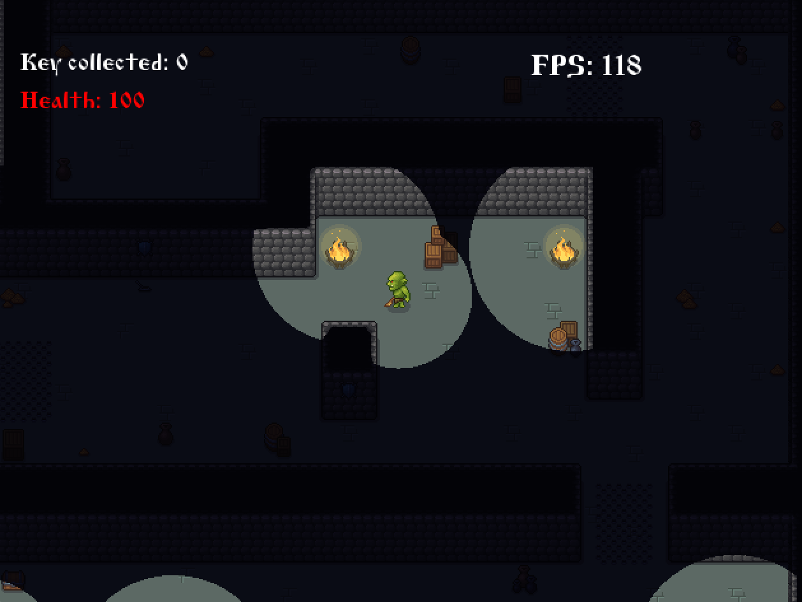

# Orc Game

**Orc Game** is a 2D game built using **SFML 3.0.1** and **TinyXML2**.  
Your goal is to collect as many keys as possible in a single round while avoiding enemies and managing the shrinking circle of light around you.

## Gameplay

- Keys spawn randomly on the map. After picking up one key, the next appears in a new random location.
- Enemies spawn every 20 seconds. When a player kills one, the remaining enemies gain additional health.
- A shrinking circle of light surrounds the player, reducing visibility over time.
- Standing near a campfire and holding the `Q` key will temporarily expand your circle of light, but it will decrease the campfire's own light radius.

## Enemy Drops

Defeated enemies may drop the following items:

- **Heart** – Restores health.
- **Whetstone** – Increases the player's attack damage.
- **Flame** – Grants night vision for 1 minute.
- **Rune** – Increases the player’s maximum health.

## Map

The game map was created using the **Tiled** editor and saved in the **TMX** format. Parsing is done using `tinyxml2`.

## Enemy AI

Enemy movement is based on a graph structure with a **shortest path algorithm**, allowing them to navigate the map intelligently and pursue the player.

## Building the Game

### macOS

To build the game on macOS, simply run:

```bash
git clone https://github.com/Woratt/orc_game.git
cd orc_game
./build.sh
```
## Windows
```bash
git clone https://github.com/Woratt/orc_game.git
cd orc_game
mkdir build && cd build
cmake ..
make
```
